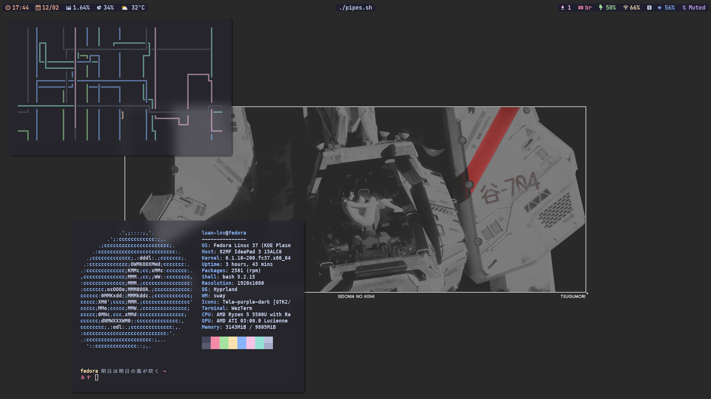
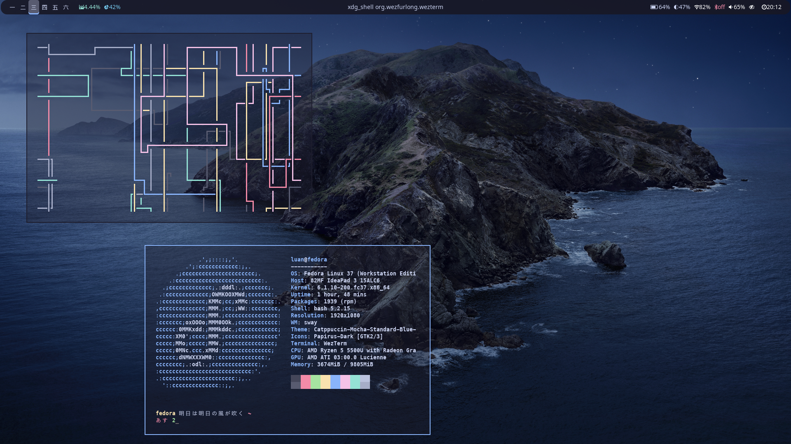

* **Window Manager** • [Hyprland ](https://github.com/hyprwm/Hyprland)
* **Shell** • [Zsh ](https://www.zsh.org)
* **Terminal** • [WezTerm ](https://github.com/wez/wezterm) terminal emulator with gpu support!
* **Panel** • [Waybar ](https://aur.archlinux.org/packages/waybar-hyprland-git)
* **Notify Daemon** • [Dunst ](https://github.com/dunst-project/dunst)
* **Launcher** • [Rofi ](https://github.com/davatorium/rofi) 
* **File Manager** • [Ranger ](https://github.com/ranger/ranger)

## 🌸 Hyprland Setup

## Sway Setup

### Install steps will be finished later! They will be added below.

<b>LONG READ</b>

### Installation 

    First of all, this is a cute disclaimer. All of this settings are installed in Artix and in wayland only! I don't know how it work in other distro.

# Packages needed
- rofi
- grim
- slurp
- waybar
- swappy
- rust-wayland-commons-devel(building [swaylock-effects](https://github.com/mortie/swaylock-effects))
- libxkbcommon-devel

## Dependencies needed for building packages below
- cairo-devel
- rofi-devel
- libtool
- libtool-devel
- autoconf
- automake
- some more I'll find out

## Packages built from source
- pamixer 
- rofi-emoji
- hyrpland
